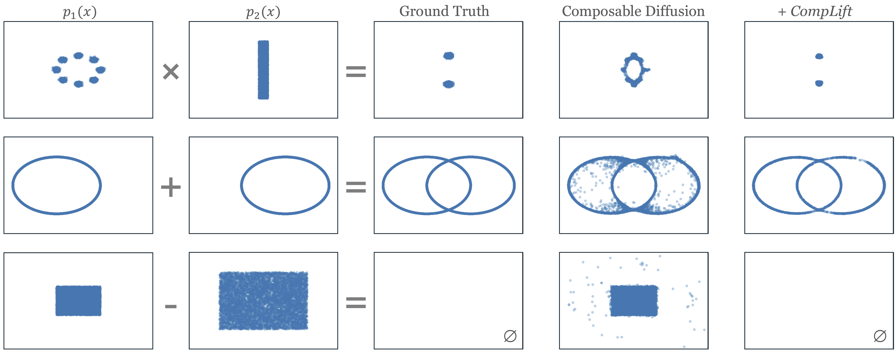
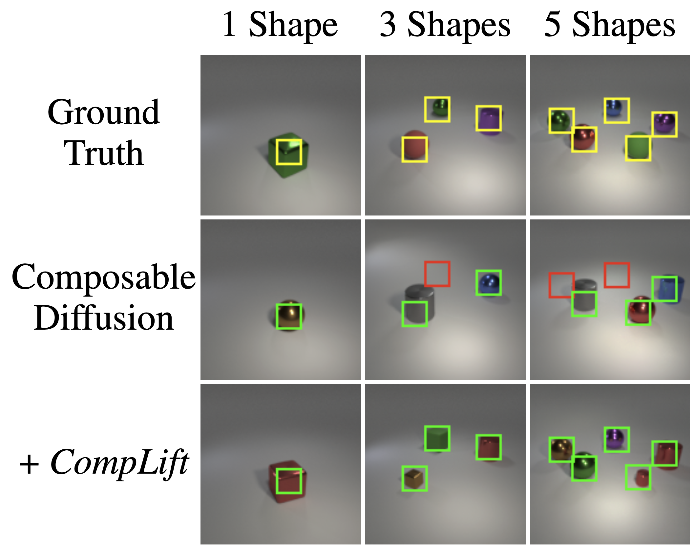

# CompLift for 2D and CLEVR Tasks &nbsp;&nbsp; [](https://colab.research.google.com/drive/1bVjGY-ym67CV8FiUxxkaMpbkWg9EQGcd?usp=sharing)


<table width="100%">
<tr>
<th> 🎨 2D Synthetic Dataset </th>
<th> 🎯 CLEVR Position Tasks </th>
</tr>
<tr>
<td width="67%" align="center">

</td>
<td width="33%" align="center">

</td>
</tr>
</table>

The official PyTorch implementation of *Improving Compositional Generation with Diffusion Models Using Lift Scores* for 2D and CLEVR tasks. For text-to-image generation, please refer to [complift-t2i](https://github.com/rainorangelemon/complift-t2i).

## 📓 Quickstart

- 2D synthetic task: Train a diffusion model and sample with CompLift with `notebooks/2d.ipynb` ([Colab](https://colab.research.google.com/drive/1bVjGY-ym67CV8FiUxxkaMpbkWg9EQGcd?usp=sharing))
- CLEVR position task: Load a pretrained diffusion model and sample with CompLift with `notebooks/clevr.ipynb` ([Colab](https://colab.research.google.com/drive/1JPm_N8NThABc5jZmgiTB4RWnNUkKp491?usp=sharing))

## 🛠️ Installation

We recommend using conda to install the environment.

```bash
# Make parent directory
mkdir complift
cd complift

# Clone the repository
git clone https://github.com/rainorangelemon/complift-2d-and-clevr.git 2d-and-clevr
conda env create -f 2d-and-clevr/environment.yaml

# Activate the environment
conda activate complift

# Install SAM2, check the SAM2 repo for more details
# NOTE: this is only required to run the CLEVR tasks
git clone https://github.com/facebookresearch/sam2.git && cd sam2
pip install -e .

# Go back to the 2d-and-clevr directory
cd ../2d-and-clevr
```

## 🎨 2D Synthetic Dataset &nbsp;&nbsp; [](https://colab.research.google.com/drive/1bVjGY-ym67CV8FiUxxkaMpbkWg9EQGcd?usp=sharing)

Make sure you are at the `2d-and-clevr` directory to run the following commands.

### Quickstart

Getting familiar with Quickstart notebook [notebooks/2d.ipynb](notebooks/2d.ipynb) first is recommended. It includes:
- Train the diffusion model
- Generate samples with different baselines

### 1. Train Diffusion Models for All Environments

This following command roughly takes 72 minutes to train all the models for 12 different distributions on a 4090 GPU.

```bash
bash scripts/train_2d.sh
```

### 2. Evaluate Baselines

The following command will evaluate the baselines on all 9 environments, roughly takes 7 minutes on a 4090 GPU.

```python
python -m scripts.run_baselines_2d
```
The results will be shown in WandB, as well as saved in `runs/baselines_2d/`.

## 🎯 CLEVR Position Tasks &nbsp;&nbsp; [](https://colab.research.google.com/drive/1JPm_N8NThABc5jZmgiTB4RWnNUkKp491?usp=sharing)

Make sure you are at the `2d-and-clevr` directory to run the following commands.

### Quickstart

Getting familiar with Quickstart notebook [notebooks/clevr.ipynb](notebooks/clevr.ipynb) first is recommended. It includes:
- Download the pretrained diffusion model and dataset
- Load the pretrained diffusion model
- Generate samples with different baselines
- Evaluate the samples using SAM2

### 1. Generate Samples

```python
python -m scripts.run_baselines_clevr +method=METHOD experiment_name=YOUR_EXPERIMENT_NAME num_constraints=NUM_CONSTRAINTS num_samples_to_generate=NUM_SAMPLES_TO_GENERATE
```
- `METHOD` can be `diffusion`, `complift`, `cached_complift`, or `ebm`
- `YOUR_EXPERIMENT_NAME` is the name of your experiment, images will be saved in `runs/MM-DD-YY_HH-MM-SS_YOUR_EXPERIMENT_NAME`
- `NUM_CONSTRAINTS` is the number of object positions to satisfy, choose between 1, 2, 3, 4, 5
- `NUM_SAMPLES_TO_GENERATE` is the number of original samples to generate for each set of constraints, we use 10 in the paper

### 2. Evaluate Samples using SAM2

```python
python -m scripts.label_sam2 num_constraints=NUM_CONSTRAINTS +image_dir=runs/MM-DD-YY_HH-MM-SS_YOUR_EXPERIMENT_NAME
```
Replace `runs/MM-DD-YY_HH-MM-SS_YOUR_EXPERIMENT_NAME` with the path to the directory containing the images you want to evaluate.

## 📝 Citation

If you find this work useful in your research, please feel free to cite:

```bibtex
@inproceedings{yu2025improving,
  title={Improving Compositional Generation with Diffusion Models Using Lift Scores},
  author={Yu, Chenning and Gao, Sicun},
  booktitle={Proceedings of the 42nd International Conference on Machine Learning (ICML)},
  year={2025}
}
```

## 📚 References

* tanelp's [tiny diffusion](https://github.com/tanelp/tiny-diffusion)
* Meta's [SAM2](https://github.com/facebookresearch/sam2)
* Du et al.'s [MCMC for Diffusion Models](https://github.com/yilundu/reduce_reuse_recycle)
* Liu et al.'s [Composable Diffusion](https://github.com/energy-based-model/Compositional-Visual-Generation-with-Composable-Diffusion-Models-PyTorch)
* HuggingFace's [diffusers](https://github.com/huggingface/diffusers) library
* lucidrains' [DDPM implementation in PyTorch](https://github.com/lucidrains/denoising-diffusion-pytorch)
* Jonathan Ho's [implementation of DDPM](https://github.com/hojonathanho/diffusion)
* InFoCusp's [DDPM implementation in tf](https://github.com/InFoCusp/diffusion_models)
